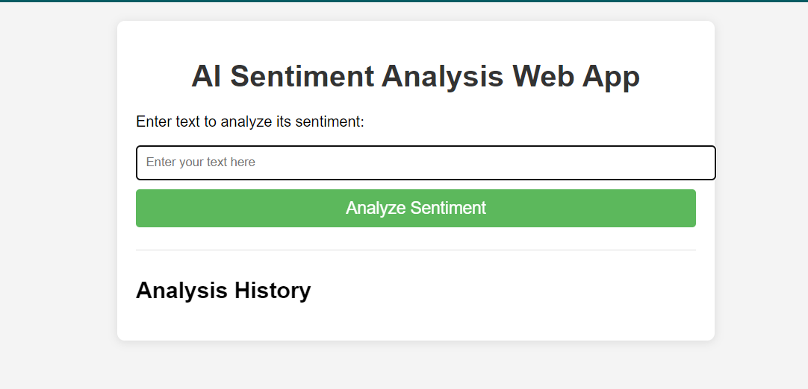
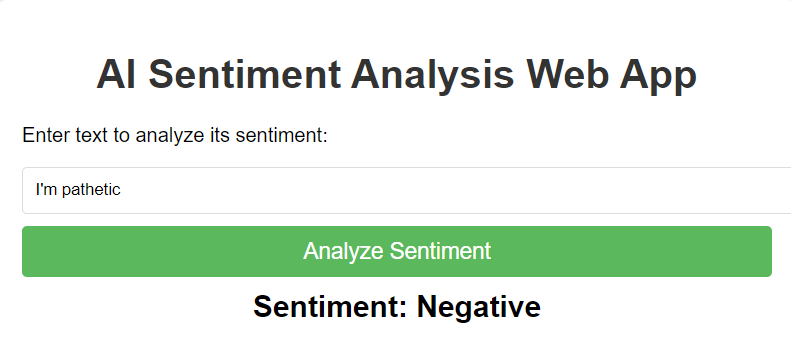
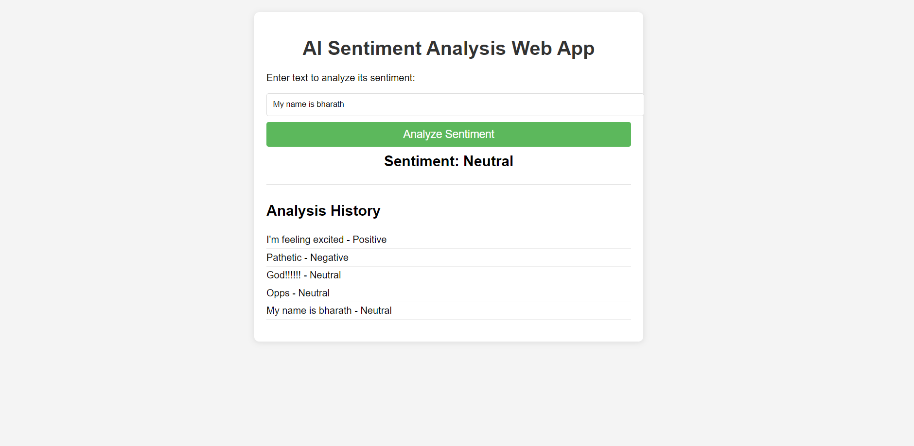
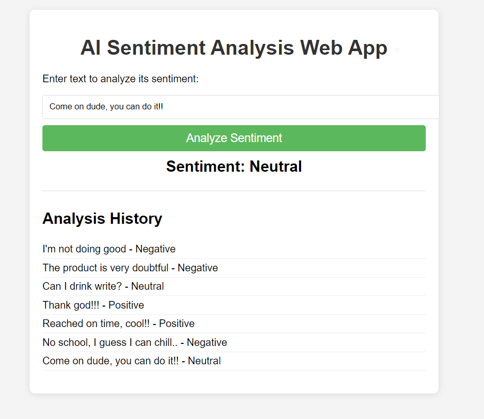

# AI Sentiment Analysis Web App

## Overview

This project is a simple AI Sentiment Analysis Web Application built using Flask and the NLTK library. The application allows users to input text and receive feedback on its sentiment (positive, neutral, or negative). It also maintains a history of analyzed texts and their respective sentiments.

## Features

- Input field for text analysis
- Real-time sentiment analysis
- Display of sentiment results
- History of previous analyses
- User-friendly interface

## Technologies Used

- **Frontend**: HTML, CSS, JavaScript
- **Backend**: Flask
- **Sentiment Analysis**: NLTK (VADER sentiment analysis)
- **Database**: SQLite

## Setup Instructions

1. **Clone the Repository**:
   ```bash
   git clone https://github.com/bharathyadav2004/AI-Sentiment-Analysis-app.git
   cd sentiment-analysis-app

## Screenshots

Here are some screenshots of the application in use:

1. **Homepage**:
   

2. **Sentiment Analysis Result**:
   
   

3. **Analysis History**:
   
